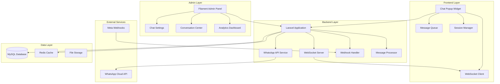

# WhatsApp Live Chat System Design

## Overview

The WhatsApp Live Chat System is a comprehensive real-time communication platform that integrates the WhatsApp Cloud API with a Laravel-based web application. The system consists of three main components: a frontend chat popup widget, a backend API service layer, and an administrative management interface. The architecture emphasizes real-time communication, security, scalability, and seamless user experience across all touchpoints.

## Architecture

### High-Level Architecture



### Component Interaction Flow

1. **Message Sending Flow**: Visitor → Chat Popup → Laravel API → WhatsApp Cloud API → WhatsApp Business
2. **Message Receiving Flow**: WhatsApp Business → Meta Webhook → Laravel Handler → WebSocket → Chat Popup
3. **Admin Management Flow**: Admin → Filament Panel → Laravel Services → Database/API
4. **Real-time Updates**: WebSocket Server ↔ Frontend Clients for live synchronization

## Components and Interfaces

### Frontend Chat Popup Component

**Technology Stack**: Vanilla JavaScript ES6+, CSS3, HTML5
**Key Features**:
- Floating circular button with notification badge
- Expandable chat interface with WhatsApp-like design
- Real-time message synchronization via WebSockets
- Offline message queuing and retry mechanisms
- Mobile-responsive and accessibility compliant

**Core Classes**:
```javascript
class WhatsAppChatWidget {
    constructor(config)
    init()
    openChat()
    closeChat()
    sendMessage(text)
    receiveMessage(message)
    updateConnectionStatus(status)
    queueOfflineMessage(message)
    retryQueuedMessages()
}

class MessageQueue {
    add(message)
    process()
    retry()
    clear()
}

class WebSocketManager {
    connect()
    disconnect()
    send(data)
    onMessage(callback)
    onStatusChange(callback)
}
```

### Backend API Services

**WhatsApp API Service**:
```php
class WhatsAppCloudService {
    public function sendMessage(string $to, string $message): array
    public function sendTemplate(string $to, string $template, array $params): array
    public function uploadMedia(UploadedFile $file): string
    public function getBusinessProfile(): array
    public function validateWebhookSignature(string $payload, string $signature): bool
}
```

**Webhook Handler Service**:
```php
class WhatsAppWebhookHandler {
    public function handleIncomingMessage(array $payload): void
    public function handleStatusUpdate(array $payload): void
    public function handleDeliveryReceipt(array $payload): void
    public function processWebhookEvent(Request $request): Response
}
```

**Real-time Communication Service**:
```php
class ChatWebSocketHandler {
    public function onConnection(ConnectionInterface $conn): void
    public function onMessage(ConnectionInterface $from, string $msg): void
    public function onClose(ConnectionInterface $conn): void
    public function broadcastToConversation(string $conversationId, array $data): void
}
```

### Admin Panel Integration

**Filament Resources and Pages**:
- `ChatSettingsPage`: Main configuration interface
- `ConversationResource`: Conversation management
- `AgentResource`: Agent account management
- `ChatAnalyticsPage`: Reporting and metrics dashboard
- `WebhookLogResource`: Webhook event monitoring

## Data Models

### Database Schema

**Conversations Table**:
```sql
CREATE TABLE conversations (
    id CHAR(36) PRIMARY KEY,
    visitor_session_id VARCHAR(255),
    whatsapp_phone_number VARCHAR(20),
    visitor_phone_number VARCHAR(20) NULL,
    agent_id BIGINT UNSIGNED NULL,
    status ENUM('active', 'waiting', 'closed') DEFAULT 'active',
    priority TINYINT DEFAULT 1,
    source VARCHAR(100) NULL,
    metadata JSON NULL,
    created_at TIMESTAMP,
    updated_at TIMESTAMP,
    INDEX idx_status (status),
    INDEX idx_agent (agent_id),
    INDEX idx_visitor_session (visitor_session_id)
);
```

**Messages Table**:
```sql
CREATE TABLE messages (
    id BIGINT UNSIGNED AUTO_INCREMENT PRIMARY KEY,
    conversation_id CHAR(36),
    whatsapp_message_id VARCHAR(255) NULL,
    direction ENUM('inbound', 'outbound'),
    sender_type ENUM('visitor', 'agent', 'system'),
    sender_id BIGINT UNSIGNED NULL,
    message_type ENUM('text', 'image', 'document', 'template') DEFAULT 'text',
    content TEXT,
    media_url VARCHAR(500) NULL,
    status ENUM('pending', 'sent', 'delivered', 'read', 'failed') DEFAULT 'pending',
    metadata JSON NULL,
    created_at TIMESTAMP,
    updated_at TIMESTAMP,
    FOREIGN KEY (conversation_id) REFERENCES conversations(id),
    INDEX idx_conversation (conversation_id),
    INDEX idx_status (status),
    INDEX idx_whatsapp_id (whatsapp_message_id)
);
```

**Chat Settings Table**:
```sql
CREATE TABLE chat_settings (
    id BIGINT UNSIGNED AUTO_INCREMENT PRIMARY KEY,
    key VARCHAR(100) UNIQUE,
    value TEXT,
    encrypted BOOLEAN DEFAULT FALSE,
    description TEXT NULL,
    created_at TIMESTAMP,
    updated_at TIMESTAMP
);
```

**Agents Table**:
```sql
CREATE TABLE chat_agents (
    id BIGINT UNSIGNED AUTO_INCREMENT PRIMARY KEY,
    user_id BIGINT UNSIGNED,
    status ENUM('online', 'away', 'offline') DEFAULT 'offline',
    max_concurrent_chats TINYINT DEFAULT 5,
    auto_assign BOOLEAN DEFAULT TRUE,
    last_activity_at TIMESTAMP NULL,
    created_at TIMESTAMP,
    updated_at TIMESTAMP,
    FOREIGN KEY (user_id) REFERENCES users(id)
);
```

**Visitor Sessions Table**:
```sql
CREATE TABLE visitor_sessions (
    id VARCHAR(255) PRIMARY KEY,
    ip_address VARCHAR(45),
    user_agent TEXT,
    referrer VARCHAR(500) NULL,
    utm_source VARCHAR(100) NULL,
    utm_medium VARCHAR(100) NULL,
    utm_campaign VARCHAR(100) NULL,
    first_visit_at TIMESTAMP,
    last_activity_at TIMESTAMP,
    page_views INT DEFAULT 1,
    metadata JSON NULL,
    created_at TIMESTAMP,
    updated_at TIMESTAMP
);
```

**Webhook Events Table**:
```sql
CREATE TABLE webhook_events (
    id BIGINT UNSIGNED AUTO_INCREMENT PRIMARY KEY,
    event_type VARCHAR(50),
    payload JSON,
    signature VARCHAR(255),
    processed BOOLEAN DEFAULT FALSE,
    processed_at TIMESTAMP NULL,
    error_message TEXT NULL,
    retry_count TINYINT DEFAULT 0,
    created_at TIMESTAMP,
    INDEX idx_processed (processed),
    INDEX idx_event_type (event_type)
);
```

### Eloquent Models

```php
class Conversation extends Model {
    protected $fillable = ['visitor_session_id', 'whatsapp_phone_number', 'visitor_phone_number', 'agent_id', 'status', 'priority', 'source', 'metadata'];
    protected $casts = ['metadata' => 'array'];
    
    public function messages(): HasMany
    public function agent(): BelongsTo
    public function visitorSession(): BelongsTo
}

class Message extends Model {
    protected $fillable = ['conversation_id', 'whatsapp_message_id', 'direction', 'sender_type', 'sender_id', 'message_type', 'content', 'media_url', 'status', 'metadata'];
    protected $casts = ['metadata' => 'array'];
    
    public function conversation(): BelongsTo
    public function sender(): MorphTo
}

class ChatAgent extends Model {
    protected $fillable = ['user_id', 'status', 'max_concurrent_chats', 'auto_assign', 'last_activity_at'];
    protected $casts = ['last_activity_at' => 'datetime'];
    
    public function user(): BelongsTo
    public function conversations(): HasMany
}
```

## Error Handling

### API Error Management

**WhatsApp API Error Handling**:
```php
class WhatsAppApiException extends Exception {
    public function __construct(string $message, int $code, array $context = [])
    public function getContext(): array
    public function shouldRetry(): bool
}

class ApiErrorHandler {
    public function handleApiError(WhatsAppApiException $e): void
    public function retryWithBackoff(callable $operation, int $maxRetries = 3): mixed
    public function logApiError(Exception $e, array $context): void
}
```

**Webhook Processing Errors**:
- Invalid signature verification → Log and reject
- Malformed payload → Queue for manual review
- Processing failures → Exponential backoff retry (max 5 attempts)
- Database errors → Alert administrators and queue for retry

**Frontend Error Handling**:
- Network connectivity issues → Show offline indicator and queue messages
- WebSocket disconnection → Automatic reconnection with exponential backoff
- Message send failures → Retry mechanism with user feedback
- Invalid input → Client-side validation with helpful error messages

### Circuit Breaker Pattern

```php
class CircuitBreaker {
    public function call(callable $operation): mixed
    public function isOpen(): bool
    public function reset(): void
    private function recordSuccess(): void
    private function recordFailure(): void
}
```

## Testing Strategy

### Unit Testing

**Backend Services**:
- WhatsApp API service methods with mocked HTTP responses
- Webhook handler with sample Meta payloads
- Message processing logic with various message types
- Database model relationships and validation rules
- Encryption/decryption of sensitive settings

**Frontend Components**:
- Chat widget initialization and state management
- Message queue operations (add, retry, clear)
- WebSocket connection handling and reconnection logic
- UI interactions and accessibility features

### Integration Testing

**API Integration**:
- End-to-end message flow from frontend to WhatsApp API
- Webhook processing with real Meta webhook signatures
- Database transaction integrity during message processing
- Real-time WebSocket message broadcasting

**Admin Panel Integration**:
- Filament resource CRUD operations
- Settings encryption and decryption
- Agent assignment and conversation routing
- Analytics data aggregation and reporting

### Performance Testing

**Load Testing Scenarios**:
- Concurrent chat sessions (target: 100+ simultaneous conversations)
- High-volume webhook processing (target: 1000+ events/minute)
- WebSocket connection scaling (target: 500+ concurrent connections)
- Database query performance under load

**Stress Testing**:
- API rate limit handling and backoff behavior
- Memory usage during large conversation histories
- File upload processing for media messages
- Admin panel responsiveness with large datasets

### Security Testing

**Authentication & Authorization**:
- Admin panel access control and role permissions
- API endpoint security and CSRF protection
- Webhook signature verification accuracy
- Token encryption and secure storage

**Input Validation**:
- Message content sanitization and XSS prevention
- File upload security and malware scanning
- SQL injection prevention in dynamic queries
- Rate limiting effectiveness against abuse

### Monitoring and Observability

**Application Metrics**:
- Message delivery success rates and latency
- WebSocket connection stability and reconnection frequency
- API response times and error rates
- Database query performance and slow query detection

**Business Metrics**:
- Conversation volume and peak usage patterns
- Agent response times and availability
- Visitor engagement and conversion rates
- System uptime and availability statistics

**Alerting Thresholds**:
- API error rate > 5% in 5-minute window
- WebSocket disconnection rate > 10% in 1-minute window
- Message delivery failure rate > 2% in 10-minute window
- Database connection pool exhaustion
- Webhook processing delays > 30 seconds